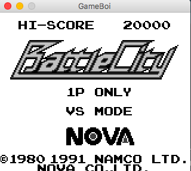

# GameBoi

GameBoi is a GameBoy emulator written in Java 8 from scratch.

### Usage

Build the emulator with `mvn clean package`. This will create a jar file in the `target` folder, run the jar with `java -jar gameboi.jar <ROM file location>`

### Progress

**CPU**: All CPU instructions implemented

**Memory**: Support for 32KB ROMs, without mappers

**GPU**: Background rendering with palette swapping

Integrated Travis-CI for reporting build status, code coverage and [documenting the code]( https://codedocs.xyz/sidmalik123/GameBoi/annotated.html).

### Blarrg's tests

The Blargg's test ROMs are used for testing the compatibility. These are run on every build. Current status

| #   | CPU Test            | Status |
| --- | ---                 | ---    |
| 01  | special             | ✅      |
| 02  | interrupts          | ❌      |
| 03  | op sp,hl            | ✅      |
| 04  | op r,imm            | ✅      |
| 05  | op rp               | ✅      |
| 06  | ld r,r              | ✅      |
| 07  | jr,jp,call,ret,rst  | ✅      |
| 08  | misc                | ✅      |
| 09  | op r,r              | ✅      |
| 10  | bit ops             | ✅      |
| 11  | op a,(hl)           | ✅      |

### Next Steps

1. Joypad support
2. Adding sprite rendering
3. Implementing memory banking
4. Sound support

### Screenshots

### Resources

* [GameBoy CPU Manual](http://marc.rawer.de/Gameboy/Docs/GBCPUman.pdf)
* [GameBoy Opcodes Map](http://pastraiser.com/cpu/gameboy/gameboy_opcodes.html)
* [Pan Docs](http://bgb.bircd.org/pandocs.htm)
* [The Ultimate GameBoy Talk](https://www.youtube.com/watch?v=HyzD8pNlpwI)
* [Imran Nazar](http://imrannazar.com/GameBoy-Emulation-in-JavaScript:-The-CPU)
* [codeslinger](http://www.codeslinger.co.uk/pages/projects/gameboy.html)
